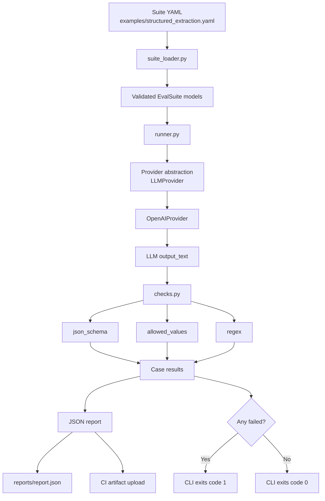

# kestrel-evals — Deterministic LLM Gating (Initial Implementation)

## BLUF
If an LLM feature depends on a structured output contract, you should be able to test that contract the same way you test normal software: with deterministic checks, repeatable suites, and CI failure when the output breaks.

That is the value proposition of `kestrel-evals`.

It gives you a compact way to:
- define LLM eval cases in YAML
- enforce mechanical correctness (JSON validity, required keys, allowed values, formatting constraints)
- generate machine-readable reports
- fail CI on regressions

The result is not a broad “AI quality platform.” It is something narrower and more operationally useful: a test harness for contract-bound LLM behaviors.

---

## Abstract
`kestrel-evals` is a small evaluation harness for LLM-powered systems where output correctness is partly or largely **mechanical**.

Instead of starting with rubric scoring, model-vs-model judging, or broad subjective grading, this project starts with a narrower claim:

> if an LLM feature depends on a structured output contract, the first evaluation layer should be deterministic.

In practice, that means checking things like:
- whether the output is valid JSON
- whether required keys exist
- whether values belong to a controlled vocabulary
- whether certain formatting guarantees are preserved

The harness takes YAML-defined suites, executes prompts against a provider, applies deterministic checks, emits a JSON report, and exits non-zero on failure so the result can gate CI.

The current implementation is intentionally small. The point is not to be a universal benchmark platform. The point is to make one common class of LLM failure visible, repeatable, and actionable.

---

## 1. Introduction
The practical challenge with LLM systems is not always that they are “wrong” in a philosophical sense. More often, they are wrong in ways that break software.

A downstream system might expect:
- valid JSON
- a fixed set of top-level keys
- empty strings instead of `null`
- a list field that uses only approved labels
- no extra commentary, markdown fences, or prose wrappers

When those assumptions are violated, the system fails long before anyone gets to debate whether the model output was clever, elegant, or broadly helpful.

That is the gap `kestrel-evals` is designed to fill.

The core idea is simple: if an LLM output is part of a production workflow, then the output contract should be testable. And if it is testable, it should be possible to run those tests locally, in CI, and in a way that fails fast when the contract breaks.

### Clear value proposition
The value proposition is not “better AI vibes.”

The value proposition is:
- fewer silent regressions in contract-bound LLM features
- faster iteration on prompts and schemas
- CI-visible failures instead of downstream breakage
- a lightweight path from “prompt experiment” to “testable subsystem”

In short: `kestrel-evals` makes a common class of LLM integration risks behave more like ordinary software quality problems.

---

## 2. Problem statement
Many LLM evaluation discussions jump immediately to nuanced questions:
- Is the answer helpful?
- Is the reasoning strong?
- Does the response feel better than another model’s response?
- Would a judge model rate this highly?

Those are legitimate questions, but they are not always the first ones that matter.

For a large class of practical systems, the first failures are much simpler:
- the model returned markdown-wrapped JSON when the system needed raw JSON
- one required field is missing
- key names drifted
- a classifier emitted a synonym instead of an allowed label
- a field that should be an array became a string
- a value that should be `""` came back as `null`

These are not subtle quality issues. They are integration-breaking contract violations.

If an LLM-powered feature sits inside a production workflow, those failures are often more important than broad subjective quality. A structurally invalid output can break downstream parsing, routing, or storage before anyone has a chance to debate whether the answer was “good.”

This project exists to address that layer first.

---

## 3. Design goal
The goal of `kestrel-evals` is straightforward:

> **Deterministic gating first.**

That means:
- define suites in a small, reviewable format
- run them locally and in CI
- check output contracts with deterministic logic
- fail quickly when those contracts are violated

The goal of this initial implementation is deliberately limited. This project is not trying to solve all evaluation problems at once.

It is trying to solve a narrower and common one well:

> Given a prompt-based feature with a known expected shape, can we catch regressions automatically and cheaply?

---

## 4. Scope and non-goals
### In scope (current implementation)
- YAML-defined suites
- local execution
- CI execution
- deterministic checks
- provider-backed generation (current provider: OpenAI)
- JSON report output
- non-zero exit on failure

### Not in scope yet
- full benchmarking platform behavior
- dataset/version registry
- annotation UI
- judge-model scoring as the primary decision mechanism
- provider-independent parity claims
- comprehensive JSON Schema support

This limitation is deliberate. The project is small on purpose.

---

## 5. Why deterministic checks deserve to be first
There are at least four reasons to start here.

### 5.1 They map directly to production failure modes
If your downstream code expects:

```json
{
  "lead_name": "...",
  "lead_email": "...",
  "services": ["website_upgrade"]
}
```

then these are real failures, not cosmetic differences:
- missing `lead_email`
- `services` not being a list
- `services` containing an unsupported label
- the model returning prose before the JSON block

These are precisely the kinds of errors deterministic checks catch well.

### 5.2 They are cheap to run and easy to explain
A failed regex, missing key, or disallowed value is easy to understand.

That matters for team adoption. Engineers and product owners are much more likely to trust an eval system when the failure explanation is concrete:
- `Missing keys: ['summary']`
- `Expected list at 'services', got str`
- `Disallowed values at 'services': ['SEO']`

### 5.3 They make CI integration natural
If the question is “did the contract hold?”, then CI can treat the eval like any other test.

That is exactly how `kestrel-evals` behaves today:
- run suite
- write report
- exit with code `1` if any case fails

This is simple enough to drop into a GitHub Actions workflow without inventing an entire orchestration layer.

### 5.4 They create a clean foundation for later subjective evaluation
Rubric scoring and LLM-as-judge can be valuable, but they are far more useful once the system is already meeting its hard constraints.

It is usually a mistake to ask “how good is this answer?” before confirming “did it even produce something structurally valid?”

---

## 6. System overview
At a high level, `kestrel-evals` has four moving parts:

1. **Suite definition** — YAML file defining cases and checks
2. **Provider call** — a provider class that turns `(system, user)` into text output
3. **Check execution** — deterministic validation against the raw output and/or parsed JSON
4. **Reporting + exit behavior** — a JSON report plus CI-friendly exit status

This keeps the architecture small and legible.

### Core files
- `src/kestrel_evals/suite_loader.py`
- `src/kestrel_evals/models.py`
- `src/kestrel_evals/providers/base.py`
- `src/kestrel_evals/providers/openai_provider.py`
- `src/kestrel_evals/checks.py`
- `src/kestrel_evals/runner.py`
- `src/kestrel_evals/cli.py`

### Architecture diagram


---

## 7. Suite definition model
Suites are authored in YAML.

Each suite defines:
- `name`
- `description`
- `cases`

Each case defines:
- `id`
- `prompt.system`
- `prompt.user`
- `checks`

This keeps the specification close to the thing being evaluated. The suite file acts as both:
- the test definition
- the documentation of the expected contract

That is an important property. It means the test suite is not hidden in scattered Python assertions or provider-specific glue code.

---

## 8. Provider abstraction
The provider abstraction is intentionally minimal.

`src/kestrel_evals/providers/base.py` defines a simple interface:
- `generate(model, system, user) -> str`

The current implementation is `OpenAIProvider` in:
- `src/kestrel_evals/providers/openai_provider.py`

This design does two useful things:
1. keeps eval logic separated from vendor-specific API calls
2. makes it straightforward to add providers later without rewriting the suite or runner logic

The project is not yet provider-rich, but the architecture already assumes it should be.

---

## 9. Check model
The current harness supports a small check vocabulary. That is a strength, not a weakness, because it keeps the system auditable.

### 9.1 `json_schema`
The current `json_schema` support is intentionally limited, but it covers a useful subset:
- object type checking
- required keys
- primitive property type checks

This is implemented in `check_json_schema()`.

It is not meant to compete with the full `jsonschema` library. It is meant to be enough for common contract enforcement without increasing dependency surface too early.

### 9.2 `allowed_values`
This check verifies that a path like `services` resolves to a list, and that every item in that list belongs to an allowed vocabulary.

This is especially useful for:
- service routing
- intent labels
- taxonomy classification
- any output where downstream code expects a controlled set of values

### 9.3 `regex`
A regex check operates on raw output text.

This is useful for lightweight assertions like:
- confirming an email-shaped string is present
- confirming a sentinel or formatting pattern appears
- validating a lightweight content constraint without writing another parser

---

## 10. Runner behavior
The runner (`src/kestrel_evals/runner.py`) executes each case in sequence.

For each case it:
1. calls the provider
2. captures raw `output_text`
3. runs the configured checks
4. records per-check pass/fail detail
5. accumulates a suite-level summary

The resulting report includes:
- suite metadata
- model used
- total / passed / failed counts
- per-case outputs
- per-check results

This format is intentionally plain JSON so it is easy to:
- inspect manually
- upload as a CI artifact
- transform later into HTML/Markdown if desired

---

## 11. CLI and CI behavior
The CLI is defined in `src/kestrel_evals/cli.py`.

Current behavior:
- load suite
- run suite
- write JSON report to stdout or a file
- exit non-zero if any case fails

That final point is what makes the project useful as a gate rather than just a reporting tool.

### Example local run
```bash
cd KestrelLabs/kestrel-evals
python -m venv .venv
source .venv/bin/activate
pip install -e .

export OPENAI_API_KEY=...

kestrel-evals run examples/structured_extraction.yaml \
  --model gpt-4.1-mini \
  --out reports/report.json
```

### Current CI workflow
A minimal GitHub Actions workflow lives at:
- `.github/workflows/evals.yml`

It:
- checks out the repo
- sets up Python
- installs the package
- runs the example suite
- uploads the resulting report as an artifact

Because the CLI exits with code `1` when there are failures, the workflow behaves like a normal test job.

---

## 12. Example suite: structured extraction
The included example suite is:
- `examples/structured_extraction.yaml`

It models a common operational problem:

> Extract a consistent structured payload from messy inbound lead emails.

That use case is representative because it contains several typical LLM failure modes at once:
- semi-structured inputs
- incomplete data
- synonyms and paraphrases
- controlled vocabularies for services
- need for strict JSON parsing downstream

### Contract enforced by the suite
The suite requires outputs to:
- be raw JSON only
- contain all required top-level fields
- use empty strings for unknowns
- emit `services` as an array
- use only allowed values for `services`

In other words, this is not “did the model get the vibe right?” It is “did it produce something the pipeline can trust?”

### Example suite summary table
| Item | Value |
|---|---|
| Suite name | `Sales lead intake extraction` |
| Purpose | Extract a consistent JSON payload from messy inbound lead emails |
| Cases | 10 |
| Model in baseline | `gpt-4.1-mini` |
| Contract style | Raw JSON + fixed top-level schema + controlled vocabulary |
| Primary checks | `json_schema`, `allowed_values`, `regex` |
| CI behavior | Fail on any case failure |

### Test case coverage table
| Case ID | Scenario covered | Main contract risk being tested |
|---|---|---|
| `basic_new_site` | clear website redesign request | base extraction + email pattern |
| `signature_block` | sparse request with contact info in signature | name/email extraction from loose formatting |
| `website_upgrade_and_maintenance` | multi-service request | multiple allowed service labels |
| `cms_setup` | field-like email with company name | CMS mapping + structured extraction |
| `budget_and_timeline` | request with explicit budget/timeline | numeric-ish text capture without schema drift |
| `ai_rnd_and_evals` | LLM feature + CI evaluation ask | AI/R&D label mapping |
| `devops_platform` | CI/CD + observability | controlled vocab for platform work |
| `security_review` | security review + auth hardening | multi-label security mapping |
| `fractional_cto` | fractional CTO + architecture review | advisory/strategy label mapping |
| `very_short` | extremely terse lead | minimum viable extraction under low context |

---

## 13. What the baseline shows
A checked-in baseline report is included here:
- `baselines/structured_extraction-2026-03-19_gpt-4.1-mini.json`

That baseline matters for two reasons.

### 13.1 It shows the suite is operational
The suite is not merely specified; it was actually executed against a model and produced a passing baseline.

### 13.2 It creates a stable reference point
Once a passing baseline exists, future changes can be evaluated against it:
- prompt changes
- suite changes
- provider changes
- model changes

That makes the harness useful not just for one run, but for tracking whether a system becomes more or less reliable over time.

### Baseline results table
| Metric | Result |
|---|---|
| Baseline artifact | `baselines/structured_extraction-2026-03-19_gpt-4.1-mini.json` |
| Model | `gpt-4.1-mini` |
| Total cases | 10 |
| Passed | 10 |
| Failed | 0 |
| Pass rate | 100% |
| Checks used | `json_schema`, `allowed_values`, `regex` |
| Intended use | local verification + CI gating |

This baseline should be read narrowly: it is one successful reference run for one suite on one model, not evidence of broad model-agnostic reliability. What it establishes is that the harness pattern works, that the suite is executable, and that a contract-bound workflow can be gated deterministically in practice.

---

## 14. Lessons from building the example suite
One practical lesson from the structured extraction example is that even strong models need **clear contract reinforcement** when the output format is strict.

In practice, the kinds of things that improved reliability were not exotic:
- restating the exact JSON shape
- insisting on no markdown / no code fences
- enforcing top-level keys
- clarifying that unknowns should be empty strings, not `null`
- adding explicit mapping guidance for controlled vocabulary fields

This is exactly why deterministic gating is useful.

It does not assume the model will “probably do the right thing.” It makes the contract visible, then tests whether the model actually honored it.

---

## 15. Design tradeoffs
### 15.1 Minimal dependency surface
The project avoids bringing in heavier validation tooling in the initial implementation.

Benefits:
- small install surface
- easy to inspect
- fewer abstraction layers
- faster iteration

Costs:
- schema support is intentionally incomplete
- some advanced validation patterns are not yet available

This is a reasonable trade for an initial implementation whose purpose is to establish a solid deterministic core.

### 15.2 Strictness over convenience
The example suite expects raw JSON only.

That means seemingly “close enough” outputs can still fail, such as:
- JSON wrapped in code fences
- extra commentary before the object

This is not accidental harshness. It reflects a real production concern: if the output must be machine-consumable, the evaluation should enforce that exact constraint.

### 15.3 Report format is functional, not polished
The current report is JSON-first and artifact-friendly.

That makes it practical, but not especially reader-friendly for non-technical audiences. Better human-readable reporting is a clear next step.

---

## 16. Where the current implementation is strongest
Today, `kestrel-evals` is strongest on cases where the output contract is explicit and the failure modes are mechanical.

That includes things like:
- structured extraction outputs
- controlled-vocabulary classification
- prompt regressions on machine-consumable responses
- CI gating for LLM features with explicit contracts

The current repo most directly validates the structured extraction / controlled-vocabulary pattern. Architecturally, the same approach is a good fit for adjacent cases such as:
- lead intake extraction
- support ticket routing labels
- metadata extraction
- internal categorization workflows
- JSON response formatting for downstream automations

The narrower and more contract-bound the output, the more credible this harness is today.
---

## 17. What it is not trying to solve yet
There are many worthwhile evaluation problems outside the current scope:
- open-ended conversational helpfulness
- nuanced style grading
- faithfulness over long-form answers
- benchmark datasets spanning many providers and models
- ranking systems with complex judging logic

Those may become relevant later, but they are not required for the project to provide immediate value.

The current claim is narrower and more defensible:

> if your system needs outputs that obey strict mechanical constraints, this harness can test that today.

---

## 18. Future directions
The next sensible expansions are fairly concrete.

### 18.1 More providers
The provider abstraction is already in place. The most obvious next additions are:
- Anthropic
- Azure OpenAI
- local or OpenAI-compatible endpoints

The point is not provider-count for its own sake, but being able to run the same suite against multiple backends without rewriting eval logic.

### 18.2 Better reporting
The current JSON artifact is useful but sparse. The next reporting step should likely be:
- Markdown summaries for humans
- HTML reports for easier review
- pass/fail diffs against a checked-in baseline
- per-case change summaries between runs

### 18.3 Dataset and baseline management
A stronger next iteration would make it easier to manage:
- named baselines
- versioned datasets
- comparison between runs over time
- explicit “current run vs baseline” output

### 18.4 Optional rubric scoring
Rubric scoring still has a place, but it should remain layered on top of deterministic gating, not replace it.

That is the right order:
1. confirm the contract holds
2. then ask whether the output quality is good

---

## 19. Conclusion
`kestrel-evals` is a deliberately small tool solving a real problem: making a class of LLM regressions testable in the same operational style as conventional software tests.

Its central argument is simple and practical:
- if an LLM feature depends on output structure,
- deterministic validation should be the first evaluation layer,
- and CI should be able to fail when that contract breaks.

That is the contribution of this initial implementation.

It is not a grand unified evaluation platform. It is a compact, production-minded harness for one of the most common and immediately useful evaluation patterns: **deterministic gating of contract-bound LLM outputs**.

### So what?
The practical implication is that teams do not have to choose between “prompt engineering in the dark” and “building a giant evaluation platform.”

There is a useful middle ground.

`kestrel-evals` shows that for contract-bound LLM features, a small amount of structure goes a long way:
- define the contract
- codify the checks
- run them locally
- gate CI on regressions

That turns a fragile prompt-dependent behavior into something closer to an ordinary software component: observable, testable, and much easier to trust.
