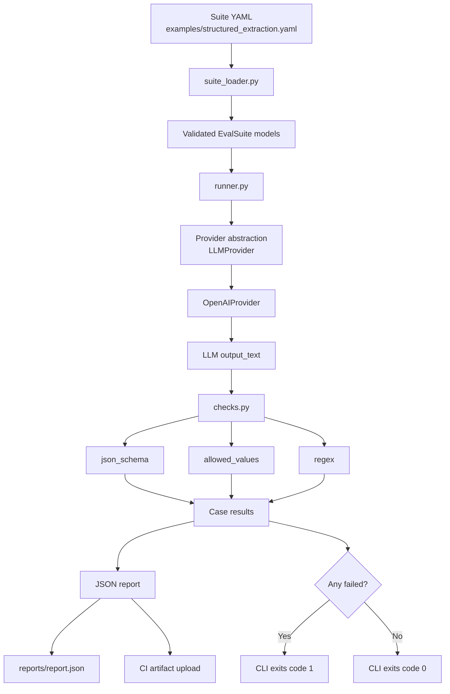

# Deterministic Gating for Contract-Bound LLM Outputs

## BLUF
If an LLM feature depends on a structured output contract, that contract should be testable in the same operational way as ordinary software: with deterministic checks, repeatable suites, and CI failure when the output breaks.

That is the purpose of `kestrel-evals`.

The project is intentionally narrow. It is not trying to solve the entire LLM evaluation problem. It is trying to solve one common and operationally important part of it well: making contract-bound LLM behaviors observable, repeatable, and gateable.

---

## Abstract
`kestrel-evals` is a small evaluation harness for LLM-powered systems where correctness is partly or largely mechanical. Rather than beginning with rubric scoring, model-vs-model judging, or broad subjective grading, it starts from a simpler premise: if an LLM feature is expected to produce machine-consumable output, then the first layer of evaluation should verify that the output actually obeys its contract.

In practice, that means checking whether the output is valid JSON, whether required keys exist, whether values remain inside a controlled vocabulary, and whether formatting guarantees are preserved. The harness takes YAML-defined suites, executes prompts against a provider, applies deterministic checks, emits a JSON report, and exits non-zero on failure so the result can gate CI.

The current implementation is intentionally small. It is not presented as a universal benchmark platform or a general theory of LLM quality. It is a working implementation of a narrower claim: for contract-bound LLM outputs, deterministic gating is often the most useful place to start.

---

## 1. Introduction
A large share of practical LLM failures do not first appear as subtle questions of quality. They appear as broken software behavior. A downstream system may expect valid JSON, a fixed set of top-level keys, empty strings rather than `null`, or a list field that contains only approved labels. When those assumptions are violated, the integration fails long before anyone has a chance to debate whether the response was insightful or well written.

That observation is the starting point for `kestrel-evals`. The project is built around a simple operational claim: if an LLM output is part of a production workflow, then the output contract should be testable. And if it is testable, it should be possible to run those tests locally, in CI, and in a form that fails fast when the contract breaks.

This framing matters because the industry conversation around LLM evaluation often broadens too quickly. It is common to jump to questions such as whether an answer is helpful, whether one model outperforms another, or whether a judge model would rate the output highly. Those are legitimate evaluation problems, but they are not always the first problems that matter. In many real systems, the first question is much less glamorous: did the model produce something the pipeline can safely consume?

That is where this project is strongest. Its value proposition is not “better AI vibes.” Its value proposition is more practical: fewer silent regressions in contract-bound LLM features, faster iteration on prompts and schemas, CI-visible failures instead of downstream breakage, and a lightweight path from prompt experimentation to something that can be treated more like ordinary software.

---

## 2. Why deterministic gating comes first
For a broad class of workflows, deterministic checks deserve to be the first evaluation layer because the earliest and most expensive failures are mechanical. A model that returns markdown-wrapped JSON when the system expects raw JSON has failed, even if the payload inside is otherwise sensible. A classifier that emits a near-synonym instead of a valid controlled label has failed, even if a human would understand what it meant. A field that should be an array but arrives as a string has failed, regardless of whether the prose around it sounds competent.

These are not cosmetic issues. They are contract violations. If the LLM sits inside a pipeline for parsing, routing, storage, or automation, they are often the difference between a working system and a broken one.

Deterministic checks are well suited to these problems because they are both cheap and legible. A failed regex, missing key, or disallowed value is easy to understand. That clarity matters. Teams are far more likely to trust an evaluation harness when the failure mode is concrete and inspectable rather than buried inside an opaque scoring system. It also makes CI integration natural: if the question is whether the contract held, then the harness can behave like any other test runner and return a failing exit code when the answer is no.

This does not make subjective evaluation unimportant. Rubric scoring, pairwise comparison, and model-as-judge approaches all have their place. The point is one of sequencing. It is usually a mistake to ask whether an answer is “good” before confirming that it is structurally valid. Deterministic gating is therefore not a replacement for all other evaluation methods. It is the right first layer for systems whose outputs must obey explicit mechanical constraints.

---

## 3. Design goals and scope
The design goal of `kestrel-evals` is deliberately constrained: define suites in a small, reviewable format; run them locally and in CI; check output contracts with deterministic logic; and fail quickly when those contracts are violated. The project is not trying to solve all evaluation problems at once. It is trying to make one common and useful pattern reliable enough to support development and deployment workflows.

That focus is reflected in the current scope. The implementation supports YAML-defined suites, local execution, CI execution, deterministic checks, provider-backed generation through an OpenAI implementation, JSON report output, and non-zero exit behavior on failure. It does not yet attempt to provide a full benchmarking platform, a dataset registry, a judge-model workflow, comprehensive JSON Schema support, or broad provider parity. Those limitations are intentional. The project is small on purpose.

---

## 4. System design and implementation
At a high level, `kestrel-evals` has four moving parts: a suite definition, a provider call, deterministic checks, and a report plus exit status. That may sound almost trivial, but that simplicity is part of the point. The harness is meant to be easy to inspect, easy to reason about, and easy to run.

The suite itself is authored in YAML. Each suite defines a name, description, and list of cases. Each case defines a system prompt, user prompt, and one or more deterministic checks. This keeps the test specification close to the behavior being evaluated. The suite file acts as both the test definition and the documentation of the expected contract.

On execution, the runner loads the suite, iterates through the cases, calls the configured provider, captures raw output, applies the requested checks, and accumulates a JSON report. The provider abstraction is intentionally minimal: it exposes a simple `generate(model, system, user) -> str` interface. The current implementation is `OpenAIProvider`, but the abstraction already isolates vendor-specific API code from suite logic and check execution. That separation matters if the project later expands to additional providers.

The checks themselves are deliberately limited. The current implementation supports a small subset of JSON Schema validation, an `allowed_values` check for controlled vocabularies, and a `regex` check against raw output text. These are enough to validate a surprisingly wide range of contract-bound behaviors without pulling in heavier dependencies or turning the project into a large framework too early.

The result is a system that is simple enough to act like a normal test runner. The CLI loads a suite, runs it, writes a report, and exits with code `1` if any case fails. That final behavior is what makes the project useful as a gate rather than merely as a reporting utility.

### Core files
- `src/kestrel_evals/suite_loader.py`
- `src/kestrel_evals/models.py`
- `src/kestrel_evals/providers/base.py`
- `src/kestrel_evals/providers/openai_provider.py`
- `src/kestrel_evals/checks.py`
- `src/kestrel_evals/runner.py`
- `src/kestrel_evals/cli.py`

### Architecture diagram

---

## 5. Example case study: structured extraction
The included example suite, `examples/structured_extraction.yaml`, models a common operational problem: extracting a consistent structured payload from messy inbound lead emails. This is a good representative case because it combines several typical LLM failure modes in a compact form. The inputs are semi-structured, some information is missing, wording varies, service names can drift into synonyms, and the downstream system expects a strict JSON payload rather than prose.

The contract enforced by the suite is intentionally strict. The output must be raw JSON only, must contain all required top-level fields, must use empty strings for unknown values, must emit `services` as an array, and must restrict that array to an approved vocabulary. In other words, the suite is not testing whether the model “roughly understood the email.” It is testing whether the model produced something the pipeline could safely trust.

The current example suite includes ten cases. Together they cover clear extraction, sparse signature-block style emails, multi-service requests, budget/timeline extraction, AI/R&D language, devops terminology, security-related mapping, advisory work, and very short low-context inputs.

### Example suite summary table
| Item | Value |
|---|---|
| Suite name | `Sales lead intake extraction` |
| Purpose | Extract a consistent JSON payload from messy inbound lead emails |
| Cases | 10 |
| Model in baseline | `gpt-4.1-mini` |
| Contract style | Raw JSON + fixed top-level schema + controlled vocabulary |
| Primary checks | `json_schema`, `allowed_values`, `regex` |
| CI behavior | Fail on any case failure |

### Test case coverage table
| Case ID | Scenario covered | Main contract risk being tested |
|---|---|---|
| `basic_new_site` | clear website redesign request | base extraction + email pattern |
| `signature_block` | sparse request with contact info in signature | name/email extraction from loose formatting |
| `website_upgrade_and_maintenance` | multi-service request | multiple allowed service labels |
| `cms_setup` | field-like email with company name | CMS mapping + structured extraction |
| `budget_and_timeline` | request with explicit budget/timeline | numeric-ish text capture without schema drift |
| `ai_rnd_and_evals` | LLM feature + CI evaluation ask | AI/R&D label mapping |
| `devops_platform` | CI/CD + observability | controlled vocab for platform work |
| `security_review` | security review + auth hardening | multi-label security mapping |
| `fractional_cto` | fractional CTO + architecture review | advisory/strategy label mapping |
| `very_short` | extremely terse lead | minimum viable extraction under low context |

One practical lesson from this case study is that strong models still need clear contract reinforcement when the output format is strict. Reliability improved not through exotic techniques, but through careful prompt and suite design: restating the exact JSON shape, insisting on no markdown or code fences, clarifying that unknowns should be empty strings rather than `null`, and adding explicit mapping guidance for controlled-vocabulary fields. That is exactly why deterministic gating is useful. It does not assume the model will “probably do the right thing.” It makes the contract visible and then tests whether the model actually honored it.

---

## 6. Baseline results
A checked-in baseline report is included at `baselines/structured_extraction-2026-03-19_gpt-4.1-mini.json`. That baseline matters because it does two things at once. First, it shows that the suite is not hypothetical: it was executed against a real model and produced a passing result. Second, it creates a stable reference point for future comparison. Prompt changes, suite changes, provider changes, and model changes can all be evaluated against the same baseline.

### Baseline results table
| Metric | Result |
|---|---|
| Baseline artifact | `baselines/structured_extraction-2026-03-19_gpt-4.1-mini.json` |
| Model | `gpt-4.1-mini` |
| Total cases | 10 |
| Passed | 10 |
| Failed | 0 |
| Pass rate | 100% |
| Checks used | `json_schema`, `allowed_values`, `regex` |
| Intended use | local verification + CI gating |

This baseline should be read narrowly. It is one successful reference run for one suite on one model, not evidence of broad model-agnostic reliability. What it establishes is that the harness pattern works, that the suite is executable, and that a contract-bound workflow can be gated deterministically in practice.

---

## 7. Design tradeoffs and limitations
The project’s strongest qualities are also its clearest limitations. By keeping the dependency surface small, the harness remains easy to inspect and easy to extend, but the current schema support is intentionally incomplete. It is enough for common contract enforcement, not a substitute for the full `jsonschema` ecosystem.

By enforcing strict raw-JSON output, the suite reflects real production constraints, but that strictness also means seemingly “close enough” outputs will still fail. A payload wrapped in code fences or preceded by commentary may be human-legible and still be unacceptable to the pipeline. This is not accidental harshness; it is a deliberate alignment between the evaluation and the downstream system’s expectations.

The current report format is similarly pragmatic rather than polished. JSON is excellent for CI artifacts and downstream tooling, but less ideal for human review than Markdown or HTML summaries would be. The current writeup can point to the baseline artifact and the suite definitions, but it should still be read as evidence of an initial implementation, not as proof that the harness has already solved broad LLM evaluation reliability.

There is also an evidentiary limit worth keeping explicit: the current repo most directly validates one pattern well, namely structured extraction with controlled vocabularies. The architecture is suitable for adjacent contract-bound problems, but the strongest direct support in the repository today is still this example case.

---

## 8. Where the current implementation is strongest
Today, `kestrel-evals` is strongest in settings where the output contract is explicit and the failure modes are mechanical. That includes structured extraction outputs, controlled-vocabulary classification, prompt regressions on machine-consumable responses, and CI gating for LLM features with hard output constraints.

The narrower and more contract-bound the output, the more credible this harness is today. That makes it a strong fit for things like lead intake extraction, support ticket routing labels, metadata extraction, internal categorization workflows, and JSON response formatting for downstream automations. It is less compelling, at least in its current form, for open-ended conversational evaluation or nuanced quality grading, which require different methods and a broader evidence base.

---

## 9. Future directions
The next sensible expansions are concrete rather than abstract. The provider abstraction already makes room for additional backends, so the most obvious next step is to add Anthropic, Azure OpenAI, or local OpenAI-compatible endpoints and run the same suites across them without rewriting the evaluation logic.

Reporting is another clear next layer. The current JSON artifact is useful, but Markdown or HTML summaries would make inspection easier, especially if they include pass/fail diffs against a checked-in baseline and per-case change summaries between runs.

Dataset and baseline management is also an obvious place to deepen the project. Named baselines, versioned datasets, and explicit “current run versus baseline” views would make it easier to track reliability over time rather than treating each run as an isolated event.

Finally, rubric scoring may still be worth adding later, but only after deterministic gating remains solid. That order matters. The correct sequence is first to confirm that the contract holds, and only then to ask whether the output quality is good.

---

## 10. Conclusion
`kestrel-evals` is a deliberately small tool solving a real problem: making a class of LLM regressions testable in the same operational style as conventional software tests.

Its central argument is simple. If an LLM feature depends on output structure, deterministic validation should be the first evaluation layer, and CI should be able to fail when that contract breaks.

That is the contribution of this initial implementation. It is not a grand unified evaluation platform. It is a compact, production-minded harness for one of the most common and immediately useful evaluation patterns: deterministic gating of contract-bound LLM outputs.

### So what?
The practical implication is that teams do not have to choose between prompt engineering in the dark and building a giant evaluation platform. There is a useful middle ground.

`kestrel-evals` shows that for contract-bound LLM features, a modest amount of structure goes a long way. Define the contract, codify the checks, run them locally, and gate CI on regressions. That does not make LLM behavior magically stable or universally reliable. What it does do is move one important class of prompt-dependent behavior closer to an ordinary software component: observable, testable, and easier to trust in production workflows.
